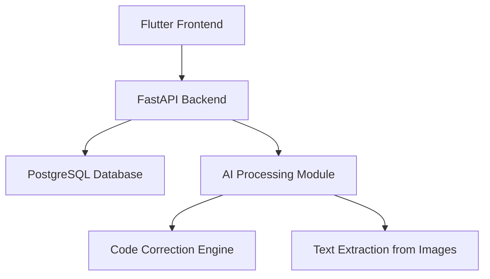

# 🚀 Learn Programming

[](https://flutter.dev/)
[](https://fastapi.tiangolo.com/)
[](https://www.postgresql.org/)

A comprehensive programming learning platform developed with Flutter for cross-platform compatibility, FastAPI for the backend, and PostgreSQL database. The backend and databases were completely designed and developed by hand, providing full control over the system.

---

## 📑 Table of Contents
- [Key Features](#key-features)
- [Screenshots](#screenshots)
- [Architecture](#architecture)
- [Getting Started](#getting-started)

---

## ✨ Key Features

### 👤 User Management
- 🔐 Login functionality
- ✅ New account creation
- 🔄 Password recovery

### 📚 Educational Content
- 🧠 **Programming Fundamentals**: Learn the basics of programming
- 🌱 **Learn Programming**: A course for learning programming from scratch
- 🎓 **Programming Course**: Courses in programming and computer science
- 🧩 **Problem Solving**: Develop programming problem-solving skills
- 📈 **Skill Development**: Improve programming and technical skills

### 📝 Programming Course Features
> Each course includes multiple chapters with tests that must be completed to proceed to the next chapter. After completing all chapters, a Final Exam is activated for the course.

Each chapter contains:
- 🎥 Video lessons
- 📖 Articles/Texts
- ❓ Quiz on each lesson

### 🛠️ Problem Solving Section
- 🗂️ Divided into various categories with problems that gradually increase in difficulty
- 💻 Allows users to write code directly or write it on paper and take a photo
- 🤖 The application uses AI to extract text from the image and automatically correct the code
- ⚠️ Displays errors to facilitate the learning process

> This application is not just an educational platform, but an interactive experience that combines programming learning and problem-solving using AI, with complete control over the infrastructure and data developed personally.

<div align="center">
  
**Get ready to start a new journey in the world of programming and problem-solving using the latest tools and technologies!**

</div>

---

## 📸 Screenshots

<div align="center">
  
| Login Screen | Home Dashboard | Problem Solving |
|:---:|:---:|:---:|
|  |  |  |
| Course Detail | Video Lesson | Quiz Interface |
|  |  |  |

</div>

> *Note: Add actual screenshots of your application in the screenshots folder and update the paths accordingly.*

---

## 🏗️ Architecture



---

## 🚦 Getting Started

For help getting started with Flutter development, view the
[online documentation](https://docs.flutter.dev/), which offers tutorials,
samples, guidance on mobile development, and a full API reference.

## 📱 Installation
```bash
# Clone the repository
git clone https://github.com/yourusername/learn_programming.git

# Navigate to the project directory
cd learn_programming

# Install dependencies
flutter pub get

# Run the app
flutter run
```
